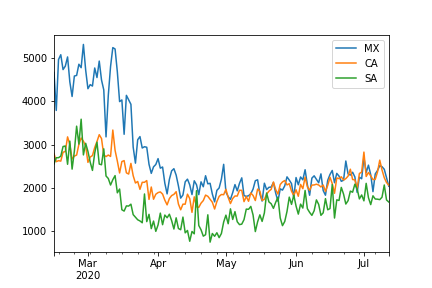
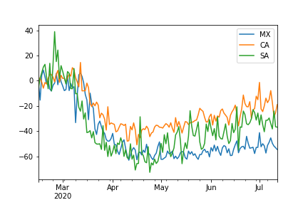

.. _place:

Mobility
==================================
.. image:: https://travis-ci.org/INGEOTEC/text_models.svg?branch=master
	   :target: https://travis-ci.org/INGEOTEC/text_models

.. image:: https://coveralls.io/repos/github/INGEOTEC/text_models/badge.svg?branch=master
	   :target: https://coveralls.io/github/INGEOTEC/text_models?branch=master

.. image:: https://badge.fury.io/py/text-models.svg
	   :target: https://badge.fury.io/py/text-models

.. image:: https://readthedocs.org/projects/text-models/badge/?version=latest
      :target: https://text-models.readthedocs.io/en/latest/?badge=latest
      :alt: Documentation Status

.. image:: https://colab.research.google.com/assets/colab-badge.svg
		:target: https://colab.research.google.com/github/INGEOTEC/text_models/blob/develop/docs/Mobility.ipynb	 

This module deals with the process of measuring human mobility 
through Twitter's data. It processes the information provided 
by Twitter and provides the displacement in different ways, 
such as the number of travels in an origin-destination matrix, 
the overall mobility, and the outward mobility. 

To illustrate the library's use, let us produce mobility plots 
on the period contemplating from February 15, 2020, to July 12, 2020. 
The following code retrieved the mobility information on the specified period.

>>> from text_models import Mobility
>>> start = dict(year=2020, month=7, day=12)
>>> end = dict(year=2020, month=2, day=15)
>>> mob = Mobility(start, end=end)

Let us start presenting mobility as the number of travels in 
Mexico, Canada, and Saudi Arabia. The following code computes 
the mobility in all the countries. The first line counts the trips 
that occurred within the country as well as the inward and outward movement. 
The information is arranged in a DataFrame or a dictionary, 
depending on whether the pandas' flag is activated. 
The second line generates the plot for the countries of interest, i.e., 
Mexico (MX), Canada (CA), Saudi Arabia (SA).

>>> data = mob.overall(pandas=True)
>>> data[["MX", "CA", "SA"]].plot()

An approach to transforming the mobility information from a number of 
trips into a percentage is by using a baseline period. 
The baseline statistics can be computed using different procedures; 
one uses the weekday, and the other uses a clustering algorithm, 
particularly k-means. The text_models library has two classes; 
one computes the percentage using weekday information, 
namely :py:class:`text_models.place.MobilityWeekday`, and the other using a clustering algorithm, 
i.e., :py:class:`text_models.place.MobilityCluster`. The following code computes 
the percentage using the weekday information; 
the code is similar to the one used to produce the previous 
figure being the only difference the class used.

>>> from text_models import MobilityWeekday
>>> mob = MobilityWeekday(start, end=end)
>>> data = mob.overall(pandas=True)
>>> data[["MX", "CA", "SA"]].plot()

To complement the overview 
of the information that can be obtained from this module, we refer 
the reader to the 
`notebook <https://colab.research.google.com/github/INGEOTEC/text_models/blob/develop/docs/Mobility.ipynb>`_.  

:mod:`text_models.place`
-------------------------------------

.. automodule:: text_models.place
   :members:
