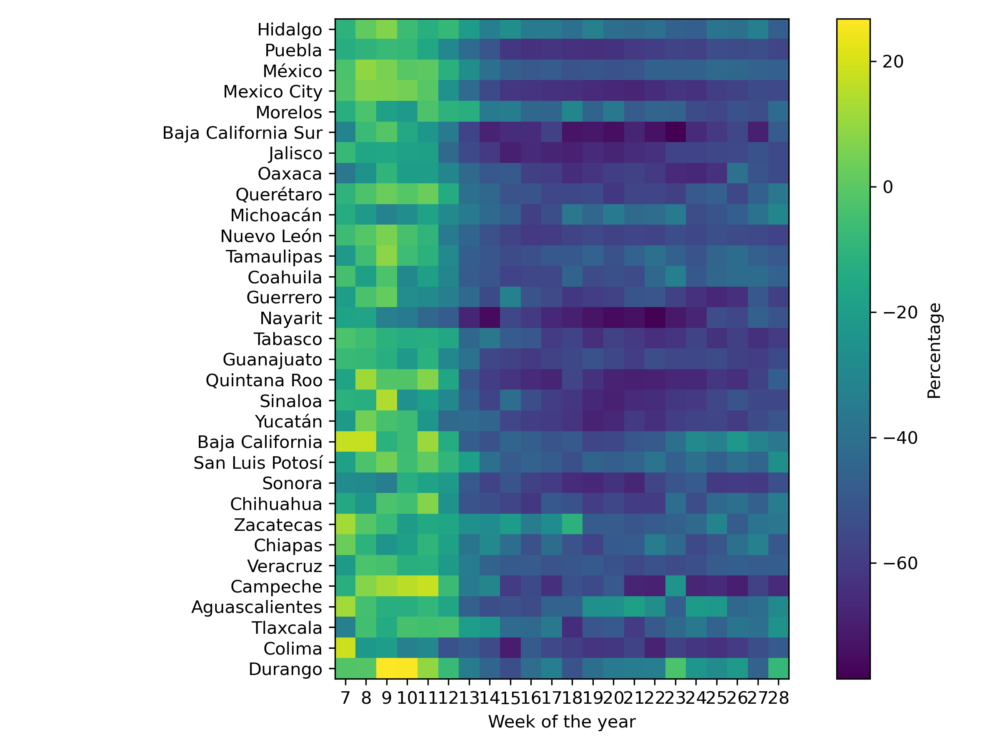

.. _place:

Mobility
==================================
.. image:: https://travis-ci.org/INGEOTEC/text_models.svg?branch=master
	   :target: https://travis-ci.org/INGEOTEC/text_models

.. image:: https://coveralls.io/repos/github/INGEOTEC/text_models/badge.svg?branch=master
	   :target: https://coveralls.io/github/INGEOTEC/text_models?branch=master

.. image:: https://badge.fury.io/py/text-models.svg
	   :target: https://badge.fury.io/py/text-models

.. image:: https://readthedocs.org/projects/text-models/badge/?version=latest
      :target: https://text-models.readthedocs.io/en/latest/?badge=latest
      :alt: Documentation Status

.. image:: https://colab.research.google.com/assets/colab-badge.svg
		:target: https://colab.research.google.com/github/INGEOTEC/text_models/blob/develop/docs/Mobility.ipynb	 

This module deals with the process of measuring human mobility 
through Twitter's data. It processes the information provided 
by Twitter and provides the displacement in different ways, 
such as the number of travels in an origin-destination matrix, 
the overall mobility, and the outward mobility. 

To illustrate the library's use, let us produce mobility plots 
on the period contemplating from February 15, 2020, to July 12, 2020. 
The following code retrieved the mobility information on the specified period.

>>> from text_models import Mobility
>>> start = dict(year=2020, month=7, day=12)
>>> end = dict(year=2020, month=2, day=15)
>>> mob = Mobility(start, end=end)

Let us start presenting mobility as the number of travels in 
Mexico, Canada, and Saudi Arabia. The following code computes 
the mobility in all the countries. The first line counts the trips 
that occurred within the country as well as the inward and outward movement. 
The information is arranged in a DataFrame or a dictionary, 
depending on whether the pandas' flag is activated. 
The second line generates the plot for the countries of interest, i.e., 
Mexico (MX), Canada (CA), Saudi Arabia (SA).

>>> data = mob.overall(pandas=True)
>>> data[["MX", "CA", "SA"]].plot()

.. image:: mx-ca-sa.png

An approach to transforming the mobility information from a number of 
trips into a percentage is by using a baseline period. 
The baseline statistics can be computed using different procedures; 
one uses the weekday, and the other uses a clustering algorithm, 
particularly k-means. The text_models library has two classes; 
one computes the percentage using weekday information, 
namely :py:class:`text_models.place.MobilityWeekday`, and the other using a clustering algorithm, 
i.e., :py:class:`text_models.place.MobilityCluster`. The following code computes 
the percentage using the weekday information; 
the code is similar to the one used to produce the previous 
figure being the only difference the class used.

>>> from text_models import MobilityWeekday
>>> mob = MobilityWeekday(start, end=end)
>>> data = mob.overall(pandas=True)
>>> data[["MX", "CA", "SA"]].plot()

.. image:: mx-ca-sa-perc.png

So far, we have seen a procedure to compute the mobility using the number 
of travels and the percentage in different countries. In order to 
complement the approach, let us compute the mobility between Mexico’s 
states. The code is similar to the one used in the previous examples, 
being the difference that one needs to provide a function 
(argument :py:attr:`level`) 
that transforms the landmark identifier into a state identifier and filters 
the landmarks that do not correspond to Mexico.

>>> data = mob.overall(level=lambda x: mob.state(x) if x[:3] == "MX:" else None, pandas=True)

Let us create a heat map to represent the mobility of all states 
into one figure. The first step is to resample the information to present 
average mobility in a week. Then, the mobility information is transposed 
to represent the states as rows and the weeks as columns. 

>>> dd = data.resample("W").mean()
>>> unico = dd.T
>>> index = unico.index.to_numpy()
>>> columns = unico.columns
>>> unico = unico.to_numpy()

In order to write the state name instead of the identifier, 
we use the following class. 

>>> from text_models.place import States
>>> states = States()

It is time to create the heatmap; the following code creates the heatmap.

>>> from matplotlib import pylab as plt
>>> fig = plt.figure(figsize=(8, 6), dpi=300)
>>> ax = fig.subplots()
>>> _ = ax.imshow(unico, cmap="viridis")
>>> cbar = fig.colorbar(_, ax=ax, orientation="vertical", shrink=1)
>>> cbar.set_label('Percentage', rotation=90)
>>> _ = plt.yticks(range(index.shape[0]), [states.name(x) for x in index])
>>> _ = plt.xticks(range(len(columns)), [x.weekofyear for x in columns])
>>> plt.xlabel("Week of the year")
>>> plt.tight_layout()
>>> plt.savefig("heatmap.png")

To complement the overview 
of the information that can be obtained from this module, we refer 
the reader to the 
`notebook <https://colab.research.google.com/github/INGEOTEC/text_models/blob/develop/docs/Mobility.ipynb>`_.  

Using your Tweets
-------------------------------------

The previous steps assumed the use of the mobility data collected and transform by ingeotec.
However, sometimes one would like to use the algorithms developed in data collected with 
different characteristics.  Let us assume the tweets are in a file called "tweets.json.gz"; 
the format is one JSON per line. In the tests, it is available some collected tweets 
to make this example self-contained. These tweets are on the following path.

>>> from text_models.tests import test_place
>>> from os.path import join
>>> DIR = test_place.DIR
>>> fname = join(DIR, "tweets.json.gz")

Then to create the origin-destination matrix used by 
:py:class:`text_models.place.Mobility`, the following code can be used. 

>>> from text_models.place import OriginDestination
>>> ori_dest = OriginDestination(fname)
>>> ori_dest.compute("210604.travel")

It is also possible to use a list of files instead of just one, 
so it is acceptable that the parameter :attr:`fname` would be a list. 
Furthermore, it might be the case that the file has a different format, 
so it is also possible to give a function (:attr:`reader`) 
that returns an iterable object where each element is a dictionary 
with the same format used by Twitter.

The last part is to use the origin-destination matrix (i.e., "210604.travel") 
in the :py:class:`text_models.place.Mobility`. 
To do so, it is needed to replace the method used to find the mobility information, 
this is provided by the parameter :attr:`data`. The following code illustrates this process. 

>>> from text_models.place import Mobility
>>> data = lambda x: join(".", x)
>>> mob = Mobility(day=dict(year=2021, month=6, day=4), window=1, data=data)
>>> dd = mob.overall(pandas=True)

:mod:`text_models.place`
-------------------------------------

.. automodule:: text_models.place
   :members:
