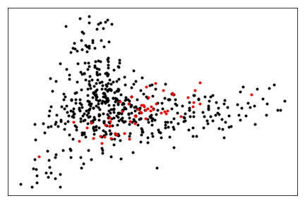

.. _text_representation:

Text Representation
==========================================

.. image:: https://github.com/INGEOTEC/text_models/actions/workflows/test.yaml/badge.svg
	   :target: https://github.com/INGEOTEC/text_models/actions/workflows/test.yaml

.. image:: https://badge.fury.io/py/text-models.svg
	  :target: https://badge.fury.io/py/text-models

.. image:: https://coveralls.io/repos/github/INGEOTEC/text_models/badge.svg?branch=develop
	  :target: https://coveralls.io/github/INGEOTEC/text_models?branch=develop

.. image:: https://dev.azure.com/conda-forge/feedstock-builds/_apis/build/status/text_models-feedstock?branchName=main
	  :target: https://dev.azure.com/conda-forge/feedstock-builds/_build/latest?definitionId=16894&branchName=main

.. image:: https://img.shields.io/conda/vn/conda-forge/text_models.svg
	  :target: https://anaconda.org/conda-forge/text_models

.. image:: https://img.shields.io/conda/pn/conda-forge/text_models.svg
	  :target: https://anaconda.org/conda-forge/text_models

.. image:: https://readthedocs.org/projects/text-models/badge/?version=latest
      :target: https://text-models.readthedocs.io/en/latest/?badge=latest
      :alt: Documentation Status

Solving a text categorization problem usually starts by deciding which text transformation 
to use; the traditional approach would be to decide on a :ref:`bow`. 
A BoW representation using q-grams of character and n-grams of words produces 
a satisfactory baseline (with term-frequency inverse document-frequency as its 
weighting scheme and linear support vector machine as the classifier, e.g.,
`B4MSA <https://b4msa.readthedocs.io/en/latest>`_). 
However, it cannot encode more information than the one used 
to learn the BoW and train the classifier. 

Techniques in semi-supervised learning have been used to incorporate information 
into text representations. The basic idea is to convert a dataset into a labeled 
dataset where the labels are automatically identified. 
The :ref:`emoji` developed here followed this idea. 
The dataset used to train these representations is a set of tweets collected 
from Twitter's open stream in Arabic, Chinese, English, French, Portuguese, 
Russian, and Spanish.

On the other hand, many competitions and datasets follow an equivalent structure 
to the approach mentioned above; these competitions can be used to increase 
the number of possible text representations.  The :ref:`dataset`  
describes the dataset and competition sets used to create text representations. 

.. _bow:

Bag of Word (BoW) Representation
--------------------------------------

The first step to including more information in the representation is to be able 
to represent the text in a format amenable to different machine learning algorithms. 
Particularly, it is used a BoW representation with q-grams of 
characters (2, 3, and 4) and words; the constraint is that the q-grams are 
only computed on the words, and consequently, there are no q-grams between words. 
The exception is Chinese, which only uses q-grams of 1, 2, and 3. 
The BoW was learned from 524,288 tweets randomly selected from the 
`text_models <https://text-models.readthedocs.io/en/latest/>`_ collection.

The BoW model is implemented with `microTC <https://microtc.readthedocs.io/en/latest/>`_; 
the only particular characteristic is that only the 16,384 more frequent tokens 
were kept in the representation. The BoW models for the different languages are found in:

* `Arabic (ar) <https://github.com/INGEOTEC/text_models/releases/download/models/ar_2.4.2.microtc>`_
* `Chinese (zh) <https://github.com/INGEOTEC/text_models/releases/download/models/zh_2.4.2.microtc>`_ 
* `English (en) <https://github.com/INGEOTEC/text_models/releases/download/models/en_2.4.2.microtc>`_
* `French (fr) <https://github.com/INGEOTEC/text_models/releases/download/models/fr_2.4.2.microtc>`_
* `Portuguese (pt) <https://github.com/INGEOTEC/text_models/releases/download/models/pt_2.4.2.microtc>`_
* `Russian (ru) <https://github.com/INGEOTEC/text_models/releases/download/models/ru_2.4.2.microtc>`_
* `Spanish (es) <https://github.com/INGEOTEC/text_models/releases/download/models/es_2.4.2.microtc>`_

These representations can be used as follows:

>>> from text_models.utils import load_bow
>>> bow = load_bow(lang='es')
>>> X = bow.transform(['Hola', 'Está funcionando'])
>>> X.shape
(2, 16384)

where the text *Hola* (*Hi* in English) and *Está funcionando* (*It is working*) 
are transformed into matrix :math:`\mathbb R^{2 \times 16384}`.

.. _emoji:

Emoji Text Representation
--------------------------------

Transforming the dataset into a labeled dataset is similar to the one used in 
`deepmoji <https://aclanthology.org/D17-1169/>`_. 
The idea is to use the emoji in the text as the labels. 
The process selects and removes the emojis in the tweets and keeps them as the 
labels of the text. The emojis kept are the ones that appear at least 1024 times 
alone, i.e., the text contains only one emoji. 

The second step is to use the labeled dataset and the BoW model with a classifier; 
it was decided to use a Linear Support Vector Machine 
(implemented in `sklearn.svm.LinearSVC`). The methodology used is one versus the rest. 
The positive class corresponds to a maximum of 262,144 tweets containing only the label at hand, 
whereas the negative class corresponds to 262,144 randomly selected from the other labels. 
If there are not enough tweets, then it is used as many tweets as possible 
as long as the set contains the same number of positive and negative examples. 
For the negative class, only tweets with unique labels are used; however, 
if there are not enough, it is allowed to use tweets with multiple labels as long as 
it does not contain the positive class. 

The following code uses the emoji representation in English using only the representation 
of the emoji identified with index 0. 

>>> from text_models.utils import load_bow, load_emoji
>>> bow = load_bow(lang='en')
>>> emo = load_emoji(lang='en', emoji=0)
>>> X = bow.transform(['This is funny', 'This is sad'])
>>> emo.decision_function(X)
array([ 1.01405812, -0.41814145])

The function :py:func:`~text_models.utils.emoji_information` 
can be used to know the available emojis. 
The information is stored in a dictionary where the keys are emojis, 
and values contain additional information such as the performance (i.e., recall), 
the number of examples of the possitive class (i.e., number), 
and the identifier (i.e., emoji). The following code shows an example:

>>> from text_models.utils import emoji_information
>>> emoji = emoji_information(lang='es')
>>> emoji['🇲🇽']
{'recall': 0.722301474084641, 'emoji': 133, 'number': 18413}

.. _dataset:

Dataset Text Representation
---------------------------------

The idea of Dataset Text Representation is, on the one hand, to increase the number 
of representations and, on the other, to test their impact on the performance 
of a text classifier. 

The datasets used are in Arabic, Chinese, English, and Spanish; 
these are text categorization problems taken from competitions such as
SemEval, TASS, and IberLEF, among others. 

The models were created using the approach one versus the rest, 
even when there are only two classes. Consequently, in a binary problem, 
there will be two models corresponding to each class being the positive class. 

The function :py:func:`~text_models.utils.dataset_information` can be used
to know which are the available datasets. It returns a dictionary where the
the keys correspond to the dataset names and the values are the labels. 

>>> from text_models.utils import dataset_information
>>> dataset = dataset_information(lang='es')
>>> dataset['HA']
array(['negative', 'neutral', 'positive'], dtype='<U8')

The model can be retrieved using the function :py:func:`~text_models.utils.load_dataset`
that requieres its name and the class index one wishes to use. 
For example, to use the *HA* model
for the *positive* label, the following code can be used:

>>> from text_models.utils import load_dataset, load_bow
>>> bow = load_bow(lang='es')
>>> ha = load_dataset(name='HA', k=2)
>>> X = bow.transform(['Buenos días', 'Estoy triste y enojado'])
>>> ha.decision_function(X)
array([ 1.16582005, -0.10821308])

where the examples are *Buenos días* (Good morning) 
and *Estoy triste y enojado* (I am sad and angry) correspond to a correct
classification. 

Dataset and Emoji Text Representations
------------------------------------------

Considering that there is a linear model for each emoji and dataset, it is feasible 
to visualize them with the aim of learning more about the similarities and differences 
between the models. 

Before starting the comparison, let us load the libraries used in the procedure. 

>>> from text_models.utils import load_bow, load_emoji, emoji_information, dataset_information, load_dataset
>>> from sklearn.metrics.pairwise import cosine_distances
>>> from sklearn.decomposition import PCA
>>> from matplotlib import pylab as plt
>>> from joblib import Parallel, delayed
>>> from tqdm import tqdm
>>> import numpy as np

The models are vectors where each component corresponds to a token; 
the BoW assigns a weight to each token. 
These weights are incorporated in the comparison by computing the 
element-wise product of the coefficients obtained by the SVM (see :py:data:`m.coef_`) 
and the weight :py:data:`w`. 

>>> def weights(models: list):
>>> 	bow = load_bow(lang=LANG)
>>> 	w = np.array([bow.token_weight[i] for i in range(len(bow.token_weight))])
>>> 	return np.array([m.coef_[0] * w for m in models])

The first step is to download the :ref:`emoji`.

>>> LANG = 'es'
>>> emoji_info = emoji_information(lang=LANG).items()
>>> emoji_models = Parallel(n_jobs=-1)(delayed(load_emoji)(lang=LANG, emoji=k)
                                       for k in tqdm(range(len(emoji_info))))

The :ref:`dataset` can be retrieved using the following code. 

>>> dataset_info = dataset_information(lang=LANG)
>>> problems = []
>>> [[problems.append(dict(name=name, lang=LANG, k=k)) for k in range(len(labels))]
     for name, labels in dataset_info.items()]
>>> dataset_models = Parallel(n_jobs=-1)(delayed(load_dataset)(**x)
                                         for x in tqdm(problems))

The representations are stored in :py:data:`emoji_models` and :py:data:`datasets_models`; 
these contain the coefficients estimated with SVM. The missing step is 
to use the weights in the BoW model, which is done with :py:func:`weights`. 
These representations are set to form a matrix where the cosine distance of all 
the pairs are computed, as can be observed in the following code. 

>>> X = np.vstack([weights(emoji_models), weights(dataset_models)])
>>> distances = cosine_distances(X)

The final step is to visualize :py:data:`X` using :py:class:`~sklearn.decomposition.PCA`
to reduce the number of dimensions to two. The figure presents in black the emojis 
and red the datasets. 

>>> pca = PCA(n_components=2).fit(distances)
>>> for x, y in pca.transform(distances[:len(emoji_info)]):
>>> 	plt.plot(x, y, 'k.')
>>> for x, y in pca.transform(distances[len(emoji_models):]):
>>> 	plt.plot(x, y, 'r.')

