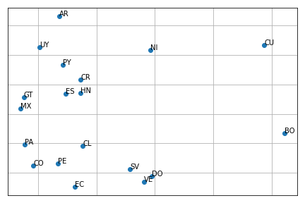

.. _voc:

Vocabulary
==================================
.. image:: https://github.com/INGEOTEC/text_models/actions/workflows/test.yaml/badge.svg
	   :target: https://github.com/INGEOTEC/text_models/actions/workflows/test.yaml

.. image:: https://badge.fury.io/py/text-models.svg
	  :target: https://badge.fury.io/py/text-models

.. image:: https://coveralls.io/repos/github/INGEOTEC/text_models/badge.svg?branch=develop
	  :target: https://coveralls.io/github/INGEOTEC/text_models?branch=develop

.. image:: https://dev.azure.com/conda-forge/feedstock-builds/_apis/build/status/text_models-feedstock?branchName=main
	  :target: https://dev.azure.com/conda-forge/feedstock-builds/_build/latest?definitionId=16894&branchName=main

.. image:: https://img.shields.io/conda/vn/conda-forge/text_models.svg
	  :target: https://anaconda.org/conda-forge/text_models

.. image:: https://img.shields.io/conda/pn/conda-forge/text_models.svg
	  :target: https://anaconda.org/conda-forge/text_models

.. image:: https://readthedocs.org/projects/text-models/badge/?version=latest
      :target: https://text-models.readthedocs.io/en/latest/?badge=latest
      :alt: Documentation Status

This module deals with the data of tokens and their frequency obtained 
from collected tweets per day. It can be used to replicate 
:py:attr:`EvoMSA.base.EvoMSA(B4MSA=True)` pre-trained model, 
to develop text models. and to analyze the tokens used in a period. 

Analyzing the vocabulary (i.e., tokens) on a day 
--------------------------------------------------------

Vocabulary class can also be used to analyze the tokens 
produced on a particular day or period. 
In the next example, let us examine the February 14th, 2020.

>>> from text_models import Vocabulary
>>> day = dict(year=2020, month=2, day=14)
>>> voc = Vocabulary(day, lang="En")
>>> voc.voc.most_common(3)
[('the', 691141), ('to', 539942), ('i', 518791)]

As can be seen, the result is not informative about 
the events that occurred in the day. Perhaps by removing 
common words would produce an acceptable representation. 

>>> voc.remove(voc.common_words())
>>> voc.voc.most_common(3)
[('valentine’s', 22137), ("valentine's", 21024), ('valentines', 20632)]

Word Clouds
-----------------------------------

The other studies that can be performed with the library are based on tokens 
and their frequency per day segmented by language and country. 
This information can serve to perform an exploratory data analysis; 
the following code creates a word cloud using words produced in 
the United States in English on February 14, 2020.

>>> from text_models import Vocabulary
>>> day = dict(year=2020, month=2, day=14)
>>> voc = Vocabulary(day, lang="En", country="US")

The tokens used to create the word cloud are obtained after removing 
the q-grams, the emojis, and frequent words.

>>> voc.remove_emojis()
>>> voc.remove(voc.common_words())

The word cloud is created using the library WordCloud. 
The first two lines import the word cloud library and the library 
to produce the plot. The third line then produces the word cloud, 
and the fourth produces the figure; the last is just an aesthetic instruction.

>>> from wordcloud import WordCloud
>>> from matplotlib import pylab as plt
>>> word_cloud = WordCloud().generate_from_frequencies(voc)
>>> plt.imshow(word_cloud)
>>> _ = plt.axis("off")

As shown in the previous word cloud, the most frequent tokens are 
related to Valentines' day. A procedure to retrieve other topics that 
occurred on this day is to remove the previous years' frequent words.

>>> voc.remove(voc.day_words(), bigrams=False)

The word cloud is created using a similar procedure being the 
only difference the tokens given to the class.

>>> word_cloud = WordCloud().generate_from_frequencies(voc)
>>> plt.imshow(word_cloud)
>>> _ = plt.axis("off")

Similarity between Spanish dialects
-----------------------------------------------

The tokens and their frequency, grouped by country, can be used to model, 
for example, the similarity of a particular language in different countries. 
In particular, let us analyze the similarity between Spanish-speaking 
countries. The procedure followed is to take randomly 30 days, 
from January 1, 2019, to July 14, 2020. The pandas' library has a function 
that handles date periods. Consequently, we use this library to gather 
the dates needed. 

>>> import pandas as pd
>>> dates = pd.date_range("2019-01-01", "2020-07-14")
>>> dates = list(pd.Series(dates).sample(30))

Once the date is selected, it is time to retrieve the tokens on the 
specified dates from the Spanish-speaking countries. 
The following codes retrieves 30 random days from the 
year 2019 to 2021. The last instruction retrieves 
the tokens and their frequency for each country.

>>> from text_models import Vocabulary
>>> from text_models.utils import date_range
>>> import random
>>> NDAYS = 30
>>> init = dict(year=2019, month=1, day=1)
>>> end = dict(year=2021, month=12, day=31)
>>> dates = date_range(init, end)
>>> random.shuffle(dates)
>>> countries = ['MX', 'CO', 'ES', 'AR',
                 'PE', 'VE', 'CL', 'EC',
                 'GT', 'CU', 'BO', 'DO',
                 'HN', 'PY', 'SV', 'NI',
                 'CR', 'PA', 'UY']
>>> avail = Vocabulary.available_dates
>>> dates = avail(dates, n=NDAYS,
                  countries=countries,
                  lang="Es")
>>> vocs = [Vocabulary(dates.copy(), lang="Es", country=c)
            for c in countries]

From the vocabulary of all the countries, it is kept the 
first :math:`n` tokens with higher frequency where :math:`n`
corresponds to the 10% of the country's vocabulary with less number
of tokens.

>>> _min = min([len(x.voc) for x in vocs])
>>> _min = int(_min * .1)
>>> tokens = [x.voc.most_common(_min) 
              for x in vocs]
>>> tokens = [set(map(lambda x: x[0], i)) 
              for i in tokens]

The Jaccard similarity matrix is defined in set operations.
The first instruction of the following line transforms the vocabulary 
into a set. It can be seen that the output is a list of sets, 
each one corresponding to a different country. The second instruction 
builds the matrix. There are two nested loops, each one iterating for 
the country sets. 

>>> X = [[len(p & t) / len( p | t)
         for t in tokens] for p in tokens]

Each row of the Jaccard similarity matrix can be as the country signature, 
so in order to depict this signature in a plane, we decided to transform 
it using Principal Component Analysis. The following code transforms 
the matrix into a matrix with two columns. 

>>> from sklearn.decomposition import PCA
>>> X = PCA(n_components=2).fit_transform(X)

Given that a two-dimensional vector represents each country, 
one can plot them in a plane using a scatter plot. The second line of the 
following code plots the vectors in a plane; meanwhile, the loop sets 
the country code close to the point. 

>>> from matplotlib import pylab as plt
>>> plt.plot(X[:, 0], X[:, 1], "o")
>>> for l, x in zip(countries, X):
>>>   plt.annotate(l, x)

:mod:`text_models.vocabulary`
------------------------------------

.. automodule:: text_models.vocabulary
   :members:   
